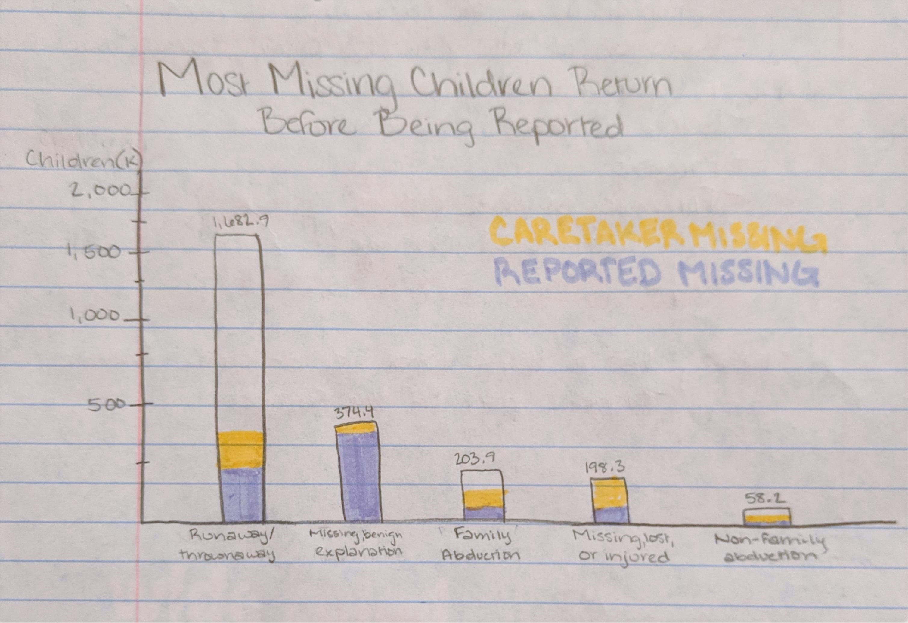
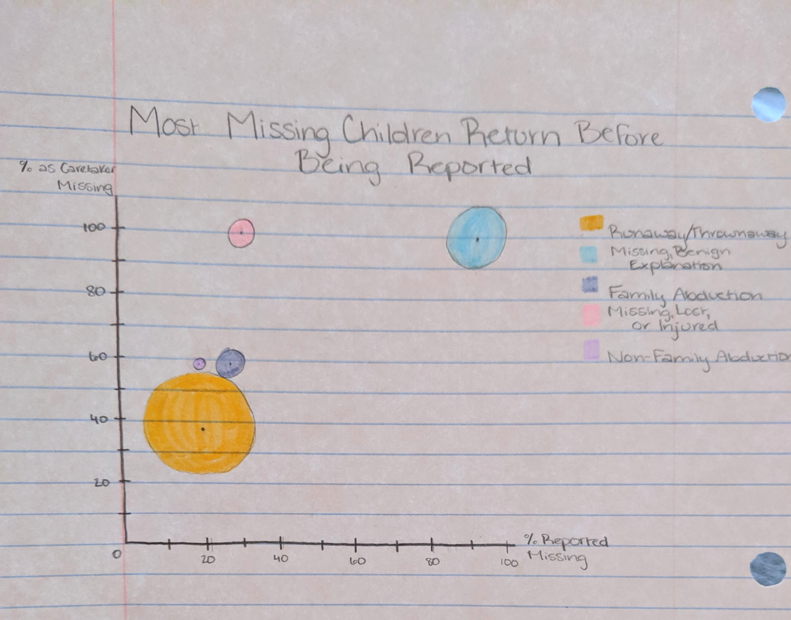

# Data Viz Re-Design 2: NISMART

## NISMART Missing Children Statistics

I selected this data to redesign because I think it is a great example of a table that makes sense in the context it was presented in, 
in that it provides specific values and percentages. However, it also leaves much room for experimentation when it comes to presenting 
the data in a way that helps the viewer to visualize how each category of missing child relates to the others.

## My Process
I began by completing a critique of the original visualization according to Stephen Few's Data Visualization Effectiveness Profile.
Through this process I began to realize how much potential there was to turn this data into something much more visually stimulating. I also took note of how much more cluttered the table was than it needed to be, which I had not noticed before. The audience could be trusted to figure out most of the cluttering information, especially in its original context, being a part of a research paper which provided further information and context on the subject. 

Next, I created the wireframe which required me to think creatively in the different ways this information could be represented. I first
went through an iteration of a layered bar graph which looked nice, but didn't allow for an accurate presentation of the percentages. Each set of percentages were a part of a separate 100%, rather than both being a part of the same whole. For this reason, I opted to create a second wireframe using a scatter plot, which allows for two separate sets of percentages on each axis and is able to show the size of each category by simply changing the size of the points. 

Collecting user feedback at this stage turned out to be incredibly valuable as it allowed me to gain an understanding of how the information in the visual came across (or didn't come across) to others, who weren't steeped in the information. Through these conversations it came to my attention that some of the labels used in the original table (ie. "Counted as Caretaker Missing") was confusing to the readers. For this reason, I changed the title of my y-axis to "Percent Missing to Caretaker" to more accurately describe what was included in that category.

## The Final Product
This final version of my visualization presents this data on Missing Children, their categorization, and the percent that is missing to the caretaker in relation to the percent of cases that are reported to an official. The further along the y-axis, the more of the cases involved the caretaker being aware that the child was missing, and the further along the x-axis, the more of the cases were reported. The size of each circle represents the number of cases documented.

[Go Back to Home Page](/README.md)
